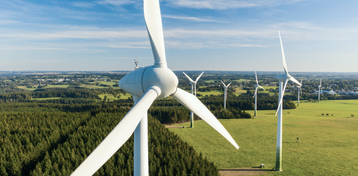

     

## Description:
Ecosolution provides a fully responsive design, tailored for any device (mobile phone, tablet, desktop). Our application offers the development and implementation of renewable, environmentally friendly energy sources. We specialize in energy generation using wind, solar, water, and biomass, offering innovative solutions for sustainable electricity production. Join us in creating an environmentally sustainable future.
Ecosolution [Live page](https://ecosolution-next-tailwind.vercel.app/).

### Features:
 Explore the principles that drive our team in the 'About' section, discover our successfully executed projects from recent years in the 'Cases' section, reach out to us to delve deeper into your ideas in the 'Contact Us' section, or find answers to frequently asked questions in the 'FAQ' section – your solution might already be there.

### Technologies Used:
- **Next.js** 
- **TypeScript** 
- **Tailwind** 
- **Formiks** 
- **Yup** 
- **Emotion**
- **React-slick-slider**

Github repository: [https://github.com/Malakhow-Alexandr/ecosolution-next-tailwind](https://github.com/Malakhow-Alexandr/ecosolution-next-tailwind)